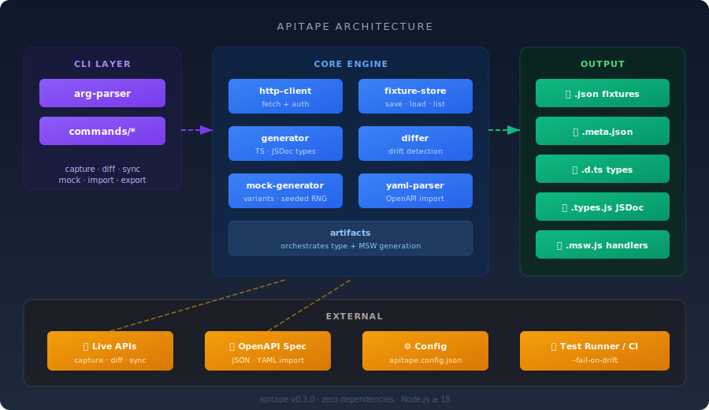
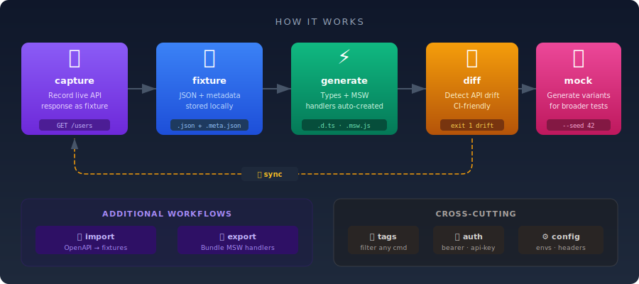

# apitape

[](https://www.npmjs.com/package/api-tape)
[](https://www.npmjs.com/package/api-tape)
[](https://github.com/nbnd-z/apitape/blob/main/LICENSE)
[](https://nodejs.org)
[](https://www.npmjs.com/package/api-tape)

Snapshot your API. Auto-generate types, mocks, and drift detection — zero runtime dependencies.

<p align="center">
  
</p>

## Why apitape?

- **One command** to capture a live API response, generate TypeScript types, and create MSW handlers
- **Drift detection** compares fixtures against the live API — catch breaking changes in CI before your tests do
- **Zero dependencies** — ships as a single package with no transitive installs
- **Programmatic API** — every function is exported for library usage

<p align="center">
  
</p>

## Install

```bash
npm install api-tape
```

## Quick Start

```bash
# 1. Initialize project
npx apitape init

# 2. Capture a live API response
npx apitape capture https://api.example.com/users --name users

# 3. Generate TypeScript types + MSW handler
npx apitape types --format typescript
npx apitape capture https://api.example.com/users --name users --typescript --msw

# 4. Detect drift in CI
npx apitape diff --fail-on-drift
```

## Commands

| Command | Description |
|---------|-------------|
| `init` | Create `fixtures/` directory and `apitape.config.json` |
| `capture <url>` | Capture an API response as a JSON fixture |
| `types` | Generate TypeScript or JSDoc types from all fixtures |
| `diff` | Compare fixtures against live API to detect drift |
| `sync` | Re-capture all fixtures from their original URLs |
| `import <spec>` | Generate fixtures from an OpenAPI spec (JSON/YAML) |
| `mock <name>` | Generate randomised data variants from a fixture |
| `export` | Bundle all MSW handlers into a single file |
| `list` | List all fixtures with metadata |
| `delete <name>` | Remove a fixture and all generated files |

Run `apitape <command> --help` for full options.

### Capture

```bash
# Auto-name from URL
apitape capture https://api.example.com/users

# Explicit name + auth + types + MSW in one shot
apitape capture https://api.example.com/users \
  --name users \
  --auth bearer --auth-token "$TOKEN" \
  --typescript --msw \
  --tag auth --tag v2

# POST with body (JSON string or @file)
apitape capture https://api.example.com/users \
  --name create-user --method POST \
  --data '{"name": "John"}'

# Capture error responses
apitape capture https://api.example.com/missing --name not-found --allow-error
```

### Drift Detection

```bash
apitape diff                          # Compare all fixtures
apitape diff --fail-on-drift --json   # CI mode: exit 1 on drift, JSON output
apitape diff --name users             # Single fixture
apitape diff --tag auth               # Tagged fixtures only
apitape diff --concurrency 8          # Parallel requests (default: 4)
```

### Sync

```bash
apitape sync                    # Re-capture all from original URLs
apitape sync --dry-run          # Preview without changes
apitape sync --backup           # Backup before overwriting
apitape sync --concurrency 8    # Parallel requests (default: 4)
```

### Mock Data

```bash
apitape mock users --count 5                    # 5 random variants
apitape mock users --count 3 --vary name email  # Vary specific fields
apitape mock users --seed 42                    # Deterministic output
apitape mock --all --typescript --msw           # All fixtures + artifacts
```

### OpenAPI Import

```bash
apitape import ./openapi.yaml --mock --typescript --msw
```

### Tagging

```bash
# Tag on capture
apitape capture https://api.example.com/login --name login --tag auth

# Filter any command by tag
apitape list --tag auth
apitape diff --tag auth
apitape sync --tag auth
apitape export --tag auth
```

## Type Generation

Nested objects produce named interfaces:

```typescript
export interface UsersAddress {
  street: string;
  city: string;
}

export interface Users {
  id: number;
  name: string;
  address: UsersAddress;
}
```

## Configuration

`apitape.config.json`:

```json
{
  "fixturesDir": "./fixtures",
  "typesOutput": "./fixtures",
  "typesFormat": "jsdoc",
  "environments": {
    "staging": { "baseUrl": "https://staging.api.example.com" },
    "production": { "baseUrl": "https://api.example.com" }
  },
  "auth": { "type": "bearer", "token": "your-default-token" },
  "defaultHeaders": { "Content-Type": "application/json" },
  "maxSizeBytes": 5242880,
  "arraySampleSize": 100
}
```

Environment resolution: `apitape capture /users --env staging` resolves to `https://staging.api.example.com/users`.

Auth in config is used automatically. CLI flags (`--auth`, `--auth-token`) override when provided.

## CI Integration

```yaml
# GitHub Actions
- name: Check API drift
  run: npx apitape diff --fail-on-drift --json
```

## Programmatic API

All core functions are exported:

```javascript
import {
  // Config
  loadConfig, resolveEnv, saveConfig, clearConfigCache,
  // HTTP
  fetchWithAuth,
  // Fixtures
  saveFixture, loadFixture, loadMetadata,
  listFixtures, deleteFixture, fixtureExists,
  // Types
  generateJSDoc, generateTypeScript, generateType, inferType, setArraySampleSize,
  // Diff
  diffObjects, formatDiffResult, hashValue, setDiffArraySampleSize,
  // Mock
  generateMockData, generateVariants, createRng,
  // MSW
  generateMSW, generateMSWHandlers,
  // Artifacts
  generateArtifacts, regenerateExistingArtifacts,
  // Errors
  ApitapeError, FixtureNotFoundError, ConfigError, FixtureSizeError, HttpRequestError,
  // Utils
  sanitizeName, toPascalCase, pAll
} from 'api-tape';
```

```javascript
const response = await fetchWithAuth('https://api.example.com/users', {
  auth: { type: 'bearer', token: 'your-token' }
});

await saveFixture('users', response.data, {
  url: 'https://api.example.com/users',
  method: 'GET',
  tags: ['auth']
});

await generateArtifacts('users', response.data,
  { typescript: true, msw: true },
  { url: 'https://api.example.com/users', method: 'GET' }
);

// Drift detection
const fixture = await loadFixture('users');
const live = await fetchWithAuth('https://api.example.com/users');
const diff = diffObjects(fixture, live.data);
if (diff.status === 'breaking') console.error(formatDiffResult(diff));

// Mock variants
const variants = generateVariants(response.data, { count: 5, variations: ['name', 'email'] });
```

## Limitations

- Array drift detection samples a configurable number of items (default: 5). Items beyond the sample are not compared.
- Mock generation is non-deterministic by default. Use `--seed` for reproducible output.
- OpenAPI import supports JSON and YAML specs.

## Requirements

Node.js ≥ 18.0.0

## Contributing

```bash
git clone https://github.com/nbnd-z/apitape.git
cd apitape
npm install
npm test
```

## License

MIT
